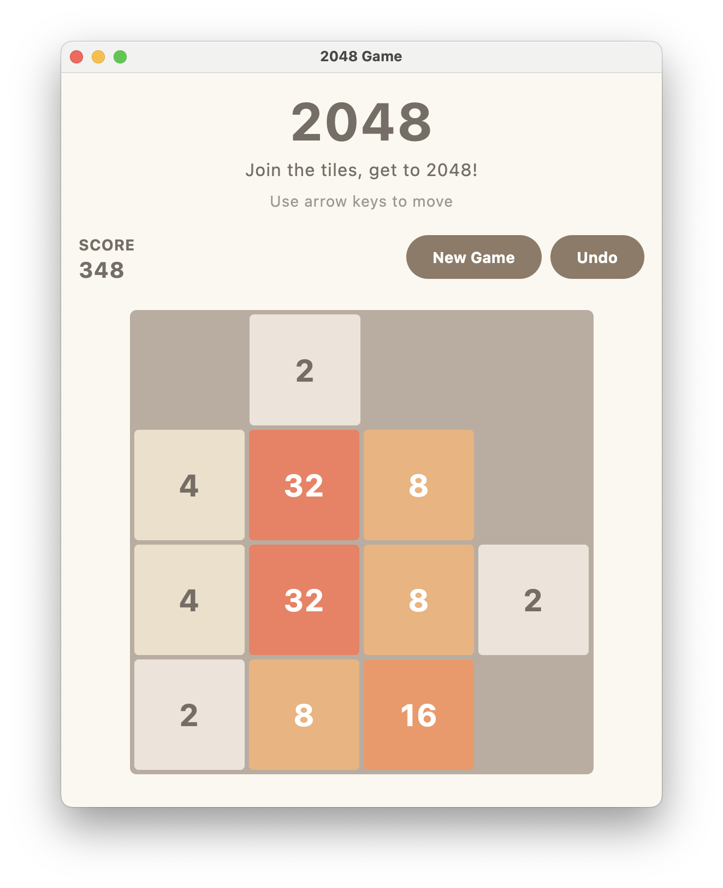

# 2048 Game

A modern implementation of the classic 2048 puzzle game, built with Kotlin and JetBrains Compose Multiplatform. The same game logic and UI run on Android (swipe + keyboard) and Desktop (keyboard).



## Features

- 🎮 Classic 2048 gameplay mechanics
- 🎨 Modern UI with Material 3 design
- ⌨️ Keyboard controls (arrow keys or WASD)
- 👆 Swipe controls on Android
- 🎯 Score tracking and game state management
- 💾 Game state persistence
- 🖼️ Smooth animations and transitions
- 📱 Responsive layout

## Technologies Used

- **Language**: Kotlin 2.1
- **UI Framework**: Compose Multiplatform with Material 3
- **Targets**: Android and Desktop (JVM)
- **Async Operations**: Kotlin Coroutines
- **Testing**: kotlin.test on the desktop JVM target

## Getting Started

### Prerequisites

- JDK 21 or later
- Android SDK (compile SDK 35) for Android builds — set `sdk.dir` in `local.properties` or export `ANDROID_HOME`

### Installation

1. Clone the repository:
   ```bash
   git clone https://github.com/yourusername/2048.git
   cd 2048
   ```

2. Build the project:
   ```bash
   ./gradlew build
   ```

3. Run on desktop:
   ```bash
   ./gradlew run
   ```

4. Build and install the Android app:
   ```bash
   ./gradlew assembleDebug
   ./gradlew installDebug
   ```

   Or open the project in Android Studio and run the `org.game2048` configuration on an emulator or device.

## How to Play

1. Swipe on the board (Android) or use arrow keys / WASD to move tiles
2. When two tiles with the same number touch, they merge into one
3. After each move, a new tile appears in a random empty spot
4. Create a tile with the number 2048 to win!
5. If you can't make a move, the game is over

## Development

This project follows clean architecture principles and Kotlin best practices. The codebase is organized into several key components:

- **Core Game Logic**: Handles game rules and mechanics
- **Game Engine**: Manages game state and processes moves
- **UI Layer**: Implements the user interface using Compose
- **Domain Models**: Defines the game's data structures

### Testing

Run the tests with:
```bash
./gradlew test
```

## License

This project is licensed under the MIT License - see the LICENSE file for details.